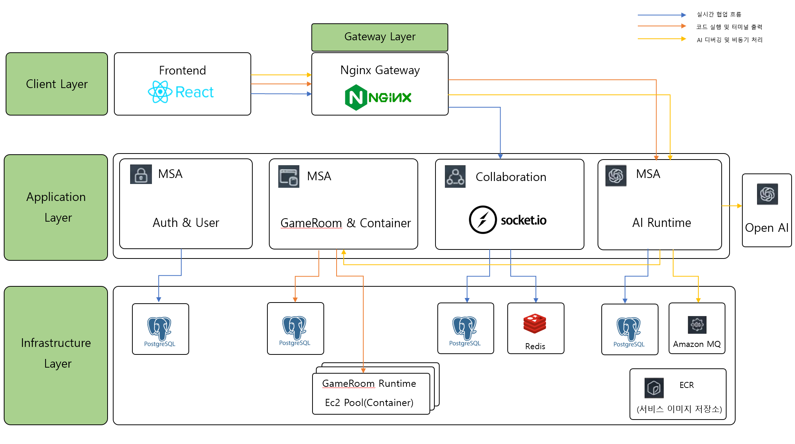

# neco-naeco

AI 게임 마스터와 함께하는 턴제 릴레이 코딩 플랫폼

비대면 학습에서 생기기 쉬운 코딩의 지루함을 게임화로 풀고, AI 결과만 소비하는 흐름에서 벗어나 직접 코드를 완성하는 경험을 만드는 프로젝트입니다.

## 프로젝트 소개

`neco-naeco`는 AI와 대화하며 게임룸을 만들고, 친구를 초대하고, 턴 단위로 코드를 이어 작성하는 협업형 코딩 플랫폼입니다.

- AI 채팅 기반 게임룸 생성 및 초대
- 턴제 릴레이 코딩 진행
- 실시간 코드 동기화
- Docker 기반 코드 실행 환경
- LLM 기반 피드백 및 힌트 제공

## 주요 기능

### 1. AI 채팅 기반 게임룸 생성

- 사용자는 자연어로 방 생성, 초대, 시작 준비를 요청할 수 있습니다.
- AI는 사용자의 의도를 해석해 게임 생성 흐름을 연결합니다.

### 2. 턴제 릴레이 코딩

- 현재 턴 사용자만 편집 권한을 가집니다.
- 제출 또는 시간 초과 시 다음 사용자에게 턴이 넘어갑니다.

### 3. 실시간 코드 동기화

- 참가자는 같은 코드 상태를 함께 확인할 수 있습니다.
- 참가자 상태, 코드 변경, 턴 전환, 결과가 WebSocket으로 즉시 반영됩니다.

### 4. 코드 실행 및 판정

- 제출된 코드는 Docker 실행 환경에서 검증됩니다.
- 실행 결과를 바탕으로 AI가 성공/실패 판정과 다음 단계 진행 여부를 결정합니다.

### 5. AI 피드백 및 힌트

- 실행 로그와 결과를 분석해 힌트를 제공합니다.
- 게임 진행 중 후속 안내 메시지와 종료 피드백을 생성합니다.

## 시스템 아키텍처

## 기술 스택

### Frontend

### Backend

### Database / Infra

## 팀 소개

| 이름 | 역할 |
| --- | --- |
| 유현하 | 팀장 / Back-end |
| 박성민 | Front-end |
| 이수현 | Back-end |
| 임현 | Front-end |
| 심정화 | Back-end |

## 시연 영상

- [YouTube 시연영상](https://www.youtube.com/watch?v=54-lugK3rK4)

## 발표 자료

- [프로젝트 계획서 PPT](./assets/project-plan.pptx)

## GitHub

- Organization: [neco-naeco](https://github.com/neco-naeco)
